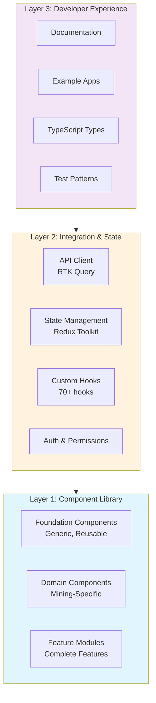

# Architecture

## Three-Layer Architecture



## Monorepo Structure

```
miningos-ui-kit/
├── packages/
│   ├── core/                    # @mdk/core - Types, constants, utilities
│   ├── hooks/                   # @mdk/hooks - 70+ custom React hooks
│   ├── state/                   # @mdk/state - Redux slices
│   ├── api-client/              # @mdk/api-client - RTK Query endpoints
│   ├── components-foundation/   # @mdk/components-foundation - Generic components
│   ├── components-domain/       # @mdk/components-domain - Mining-specific
│   ├── features/                # @mdk/features - Complete feature modules
│   └── theme/                   # @mdk/theme - Design system
├── apps/
│   ├── docs/                    # Documentation site
│   ├── playground/              # Component playground
│   └── cli/                     # CLI tools
└── examples/
    ├── minimal-app/             # Minimal example
    └── dashboard-app/           # Full dashboard example
```

## Package Dependencies

```mermaid
graph LR
    App[Your Application]
    Features[@mdk/features]
    Domain[@mdk/components-domain]
    Foundation[@mdk/components-foundation]
    API[@mdk/api-client]
    State[@mdk/state]
    Hooks[@mdk/hooks]
    Core[@mdk/core]
    Theme[@mdk/theme]

    App --> Features
    App --> Domain
    App --> Foundation
    App --> API
    App --> State

    Features --> Domain
    Features --> Foundation
    Domain --> Foundation
    Domain --> Hooks
    Foundation --> Core
    Foundation --> Theme
    API --> Core
    State --> Core
    Hooks --> Core

    style App fill:#4caf50
    style Features fill:#2196f3
    style Domain fill:#ff9800
    style Foundation fill:#9c27b0
```

## Core Packages

### `@mdk/core`

**Purpose**: Shared types, constants, and utilities

**Contents**:

- TypeScript types and interfaces
- Shared constants (routes, colors, units, etc.)
- Pure utility functions
- Common type guards

**Usage**:

```typescript
import { DeviceType, formatHashrate, isValidMiner } from '@mdk/core';
```

---

### `@mdk/components-foundation`

**Purpose**: Generic, reusable UI components

**Contents**:

- DataTable (sortable, filterable, paginated)
- Chart wrappers (LineChart, BarChart, DoughnutChart)
- Form components (Input, Select, Checkbox, etc.)
- Layout components (Grid, Flex, Container)
- Feedback components (Alert, Toast, Loading)

**Usage**:

```typescript
import { Button, DataTable, LineChart } from '@mdk/components-foundation';
```

**Key Features**:

- Built on shadcn/ui + Radix UI
- Zero CSS-in-JS runtime
- Fully accessible (WCAG compliant)
- Highly customizable via props

---

### `@mdk/components-domain`

**Purpose**: Mining-specific components

**Contents**:

- DeviceExplorer, MinerCard, ListView
- Container components
- HashRateChart, TemperatureMonitor
- AlertsWidget, PoolStatusCard
- Real-time data displays

**Usage**:

```typescript
import { MinerCard, HashRateChart, DeviceExplorer } from '@mdk/components-domain';
```

---

### `@mdk/features`

**Purpose**: Complete, ready-to-use feature modules

**Contents**:

- Dashboard module (complete single-site dashboard)
- Device Management module (Explorer + List + Details)
- Container Management module (all container types)
- Alert Management module
- Reporting module (basic)
- Settings module
- Multi-Site Dashboard module

**Usage**:

```typescript
import { DashboardModule, DeviceManagementModule } from "@mdk/features";

function App() {
  return (
    <DashboardModule
      siteId="site-1"
      refreshInterval={30000}
      customMetrics={["hashrate", "temperature"]}
    />
  );
}
```

---

### `@mdk/api-client`

**Purpose**: RTK Query-based API client with 87+ hooks

**Contents**:

- Auth endpoints (getUserinfo, postToken, getUserPermissions)
- Device endpoints (getListThings, getThingConfig)
- Operations endpoints (hashrate, consumption, workers, efficiency)
- Financial endpoints (revenue, costs, production)
- Reports endpoints (multi-site reports)
- Intelligent caching (5-min retention, 30s refetch)
- Tag-based invalidation

**Usage**:

```typescript
import { useGetListThingsQuery, useGetOperationsHashrateQuery } from "@mdk/api-client";

function DeviceList() {
  const { data, isLoading } = useGetListThingsQuery({ siteId: "site-1" });

  if (isLoading) return <Loading />;
  return <div>{data.things.map(thing => <MinerCard key={thing.id} {...thing} />)}</div>;
}
```

---

### `@mdk/hooks`

**Purpose**: 70+ custom React hooks

**Contents**:

- Data fetching hooks (useDeviceData, useRealTimeMetrics)
- Business logic hooks (useHashrateCalculation, useEfficiencyScore)
- UI utility hooks (useDebounce, useLocalStorage, useMediaQuery)
- Real-time hooks (useWebSocket, usePolling)
- Form hooks (useFormValidation, useFieldArray)

**Usage**:

```typescript
import { useDebounce, useLocalStorage, useRealTimeMetrics } from '@mdk/hooks';

function SearchBar() {
  const [search, setSearch] = useState('');
  const debouncedSearch = useDebounce(search, 300);
  const [recentSearches, setRecentSearches] = useLocalStorage('recent-searches', []);

  // ... rest of component
}
```

---

### `@mdk/state`

**Purpose**: Redux Toolkit state management

**Contents**:

- Authentication slice (user, token, permissions)
- Device selection slice (selected devices, filters)
- Notification slice (toasts, alerts)
- Theme slice (dark/light mode, preferences)
- Feature flags slice
- UI state slice (sidebar, modals)

**Usage**:

```typescript
import { useAppSelector, useAppDispatch, selectSelectedDevices } from '@mdk/state';

function DeviceActions() {
  const dispatch = useAppDispatch();
  const selectedDevices = useAppSelector(selectSelectedDevices);

  // ... rest of component
}
```

---

### `@mdk/theme`

**Purpose**: Design system and theming

**Contents**:

- Design tokens (colors, spacing, typography)
- Light/dark theme definitions
- CSS variables for performance
- Theme provider component
- Theme switching utilities

**Usage**:

```typescript
import { ThemeProvider, useTheme } from "@mdk/theme";

function App() {
  return (
    <ThemeProvider defaultTheme="dark">
      <YourApp />
    </ThemeProvider>
  );
}

function ThemeToggle() {
  const { theme, setTheme } = useTheme();
  return <button onClick={() => setTheme(theme === "dark" ? "light" : "dark")}>Toggle</button>;
}
```

---

## Technology Stack

### Core Framework

- **React** 19.0+ - UI framework
- **TypeScript** 5.8+ - Type safety (strict mode)
- **Vite** 6.3+ - Build tool

### Package Management

- **pnpm** 9+ - Fast, disk-efficient package manager
- **Turborepo** - Build orchestration with caching

### UI Components & Styling

- **shadcn/ui** - Copy-paste component collection (~46KB)
- **Radix UI** - Headless, accessible primitives (~30KB)
- **SASS/SCSS** - Styling (zero CSS-in-JS runtime)

### State Management

- **RTK Query** 2.2+ - Server state, data fetching, caching
- **Redux Toolkit** 2.2+ - UI state management
- **react-redux** 9.1+ - Redux bindings

### Forms & Validation

- **React Hook Form** 7.51+ - Form state management (5x faster than Formik)
- **Zod** 3.22+ - Schema validation (TypeScript-first)

### Data Visualization

- **Chart.js** 4.4+ - General charts
- **lightweight-charts** 4.1+ - Financial charts
- **react-chartjs-2** 5.2+ - React wrapper

### Utilities

- **date-fns** 3.6+ - Date manipulation
- **nanoid** 5.1+ - ID generation
- **p-queue** 8.0+ - Concurrency control
- **p-retry** 6.2+ - Retry logic
- **lodash-es** 4.17+ - Utility library

### Testing

- **Vitest** 3.0+ - Test runner
- **React Testing Library** 16.1+ - Component testing
- **@testing-library/user-event** 14.5+ - User interactions

### Build & Dev Tools

- **ESLint** 9.35+ - Linting (antfu config)
- **Husky** + **lint-staged** - Pre-commit hooks
- **Turborepo** - Monorepo build orchestration

### Monitoring

- **Sentry** 8.24+ - Error tracking

---

## Performance

### Bundle Size Targets

| Package                      | Target Size (gzipped) | Current Size |
| ---------------------------- | --------------------- | ------------ |
| `@mdk/core`                  | < 50KB                | TBD          |
| `@mdk/components-foundation` | < 150KB               | TBD          |
| `@mdk/components-domain`     | < 200KB               | TBD          |
| `@mdk/features`              | < 250KB               | TBD          |
| `@mdk/api-client`            | < 100KB               | TBD          |
| `@mdk/hooks`                 | < 50KB                | TBD          |
| `@mdk/state`                 | < 50KB                | TBD          |
| `@mdk/theme`                 | < 30KB                | TBD          |

**Total**: < 500KB (vs. 700KB legacy)

### Performance Metrics

- **Lighthouse Score**: > 90
- **Initial Load Time**: < 2s
- **Time to Interactive**: < 3s
- **Form Rendering**: < 10ms per keystroke (5x faster than Formik)

### Optimization Techniques

- **Tree-shaking**: All packages support tree-shaking
- **Code splitting**: Route-based and component-level
- **Lazy loading**: Heavy components loaded on-demand
- **CSS variables**: Zero CSS-in-JS runtime overhead
- **Intelligent caching**: RTK Query with 5-min retention
