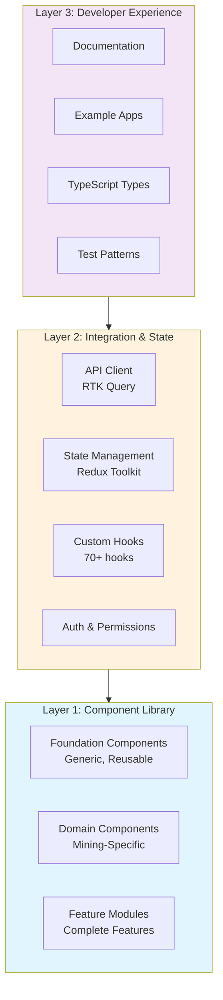

# MDK UI Development Kit

> A developer-first toolkit providing pre-built components and seamless backend integration for building mining operations applications in days instead of weeks.

[](https://github.com/tetherto/miningos-ui-kit/actions)
[](https://github.com/tetherto/moria-app-ui/blob/staging/LICENSE)

## 📋 Table of Contents

- [Overview](#overview)
- [Architecture](#architecture)
- [Getting Started](#getting-started)
- [Package Structure](#package-structure)
- [Technology Stack](#technology-stack)
- [Development](#development)
- [Contributing](#contributing)
- [Publishing](#publishing)
- [Performance](#performance)
- [Resources](#resources)

---

## Overview

The **MDK UI Development Kit** is a comprehensive toolkit providing:

- **150-200+ production-tested components** (foundation + domain-specific)
- **87+ API integration hooks** (RTK Query-based)
- **70+ custom React hooks** for common patterns
- **Complete state management** (Redux Toolkit)
- **Modern tech stack** (React 19, shadcn/ui, React Hook Form, Zod)
- **5x faster forms** compared to legacy solutions

### Key Benefits

- 🚀 **10x faster development** - Build dashboards in days, not weeks
- 🎨 **Consistent UX** - Uniform design patterns across all applications
- 🔌 **Seamless integration** - Type-safe API client with intelligent caching
- 🎯 **Battle-tested** - Extracted from production Mining OS codebase
- 📦 **Zero CSS-in-JS runtime** - Better performance, smaller bundles
- ♿ **Accessible by default** - WCAG compliant components

---

## Architecture

### Three-Layer Architecture



### Monorepo Structure

```
miningos-ui-kit/
├── packages/
│   ├── core/                    # @mdk/core - Types, constants, utilities
│   ├── hooks/                   # @mdk/hooks - 70+ custom React hooks
│   ├── state/                   # @mdk/state - Redux slices
│   ├── api-client/              # @mdk/api-client - RTK Query endpoints
│   ├── components-foundation/   # @mdk/components-foundation - Generic components
│   ├── components-domain/       # @mdk/components-domain - Mining-specific
│   ├── features/                # @mdk/features - Complete feature modules
│   └── theme/                   # @mdk/theme - Design system
├── apps/
│   ├── docs/                    # Documentation site
│   ├── playground/              # Component playground
│   └── cli/                     # CLI tools
└── examples/
    ├── minimal-app/             # Minimal example
    └── dashboard-app/           # Full dashboard example
```

### Package Dependencies

```mermaid
graph LR
    App[Your Application]
    Features[@mdk/features]
    Domain[@mdk/components-domain]
    Foundation[@mdk/components-foundation]
    API[@mdk/api-client]
    State[@mdk/state]
    Hooks[@mdk/hooks]
    Core[@mdk/core]
    Theme[@mdk/theme]
    
    App --> Features
    App --> Domain
    App --> Foundation
    App --> API
    App --> State
    
    Features --> Domain
    Features --> Foundation
    Domain --> Foundation
    Domain --> Hooks
    Foundation --> Core
    Foundation --> Theme
    API --> Core
    State --> Core
    Hooks --> Core
    
    style App fill:#4caf50
    style Features fill:#2196f3
    style Domain fill:#ff9800
    style Foundation fill:#9c27b0
```

---

## Getting Started

### Prerequisites

- **Node.js** 20+ (LTS)
- **pnpm** 9+ (package manager)

### Installation

```bash
# Clone the repository
git clone https://github.com/tetherto/miningos-ui-kit.git
cd miningos-ui-kit

# Install dependencies
pnpm install

# Build all packages
pnpm build
```

### Quick Start

```bash
# Run all packages in dev mode
pnpm dev

# Run specific package
pnpm dev --filter @mdk/components-foundation

# Build all packages
pnpm build

# Run tests
pnpm test

# Lint and typecheck
pnpm check
```

---

## Package Structure

### Core Packages

#### `@mdk/core`

**Purpose**: Shared types, constants, and utilities

**Contents**:
- TypeScript types and interfaces
- Shared constants (routes, colors, units, etc.)
- Pure utility functions
- Common type guards

**Usage**:
```typescript
import { DeviceType, formatHashrate, isValidMiner } from "@mdk/core";
```

---

#### `@mdk/components-foundation`

**Purpose**: Generic, reusable UI components

**Contents**:
- DataTable (sortable, filterable, paginated)
- Chart wrappers (LineChart, BarChart, DoughnutChart)
- Form components (Input, Select, Checkbox, etc.)
- Layout components (Grid, Flex, Container)
- Feedback components (Alert, Toast, Loading)

**Usage**:
```typescript
import { Button, DataTable, LineChart } from "@mdk/components-foundation";
```

**Key Features**:
- Built on shadcn/ui + Radix UI
- Zero CSS-in-JS runtime
- Fully accessible (WCAG compliant)
- Highly customizable via props

---

#### `@mdk/components-domain`

**Purpose**: Mining-specific components

**Contents**:
- DeviceExplorer, MinerCard, ListView
- Container components (Bitdeer, MicroBT, EMCA, Gabbani)
- HashRateChart, TemperatureMonitor
- AlertsWidget, PoolStatusCard
- Real-time data displays

**Usage**:
```typescript
import { MinerCard, HashRateChart, DeviceExplorer } from "@mdk/components-domain";
```

---

#### `@mdk/features`

**Purpose**: Complete, ready-to-use feature modules

**Contents**:
- Dashboard module (complete single-site dashboard)
- Device Management module (Explorer + List + Details)
- Container Management module (all container types)
- Alert Management module
- Reporting module (basic)
- Settings module
- Multi-Site Dashboard module

**Usage**:
```typescript
import { DashboardModule, DeviceManagementModule } from "@mdk/features";

function App() {
  return (
    <DashboardModule
      siteId="site-1"
      refreshInterval={30000}
      customMetrics={["hashrate", "temperature"]}
    />
  );
}
```

---

#### `@mdk/api-client`

**Purpose**: RTK Query-based API client with 87+ hooks

**Contents**:
- Auth endpoints (getUserinfo, postToken, getUserPermissions)
- Device endpoints (getListThings, getThingConfig)
- Operations endpoints (hashrate, consumption, workers, efficiency)
- Financial endpoints (revenue, costs, production)
- Reports endpoints (multi-site reports)
- Intelligent caching (5-min retention, 30s refetch)
- Tag-based invalidation

**Usage**:
```typescript
import { useGetListThingsQuery, useGetOperationsHashrateQuery } from "@mdk/api-client";

function DeviceList() {
  const { data, isLoading } = useGetListThingsQuery({ siteId: "site-1" });
  
  if (isLoading) return <Loading />;
  return <div>{data.things.map(thing => <MinerCard key={thing.id} {...thing} />)}</div>;
}
```

---

#### `@mdk/hooks`

**Purpose**: 70+ custom React hooks

**Contents**:
- Data fetching hooks (useDeviceData, useRealTimeMetrics)
- Business logic hooks (useHashrateCalculation, useEfficiencyScore)
- UI utility hooks (useDebounce, useLocalStorage, useMediaQuery)
- Real-time hooks (useWebSocket, usePolling)
- Form hooks (useFormValidation, useFieldArray)

**Usage**:
```typescript
import { useDebounce, useLocalStorage, useRealTimeMetrics } from "@mdk/hooks";

function SearchBar() {
  const [search, setSearch] = useState("");
  const debouncedSearch = useDebounce(search, 300);
  const [recentSearches, setRecentSearches] = useLocalStorage("recent-searches", []);
  
  // ... rest of component
}
```

---

#### `@mdk/state`

**Purpose**: Redux Toolkit state management

**Contents**:
- Authentication slice (user, token, permissions)
- Device selection slice (selected devices, filters)
- Notification slice (toasts, alerts)
- Theme slice (dark/light mode, preferences)
- Feature flags slice
- UI state slice (sidebar, modals)

**Usage**:
```typescript
import { useAppSelector, useAppDispatch, selectSelectedDevices } from "@mdk/state";

function DeviceActions() {
  const dispatch = useAppDispatch();
  const selectedDevices = useAppSelector(selectSelectedDevices);
  
  // ... rest of component
}
```

---

#### `@mdk/theme`

**Purpose**: Design system and theming

**Contents**:
- Design tokens (colors, spacing, typography)
- Light/dark theme definitions
- CSS variables for performance
- Theme provider component
- Theme switching utilities

**Usage**:
```typescript
import { ThemeProvider, useTheme } from "@mdk/theme";

function App() {
  return (
    <ThemeProvider defaultTheme="dark">
      <YourApp />
    </ThemeProvider>
  );
}

function ThemeToggle() {
  const { theme, setTheme } = useTheme();
  return <button onClick={() => setTheme(theme === "dark" ? "light" : "dark")}>Toggle</button>;
}
```

---

## Technology Stack

### Core Framework

- **React** 19.0+ - UI framework
- **TypeScript** 5.8+ - Type safety (strict mode)
- **Vite** 6.3+ - Build tool

### Package Management

- **pnpm** 9+ - Fast, disk-efficient package manager
- **Turborepo** - Build orchestration with caching

### UI Components & Styling

- **shadcn/ui** - Copy-paste component collection (~46KB)
- **Radix UI** - Headless, accessible primitives (~30KB)
- **SASS/SCSS** - Styling (zero CSS-in-JS runtime)

### State Management

- **RTK Query** 2.2+ - Server state, data fetching, caching
- **Redux Toolkit** 2.2+ - UI state management
- **react-redux** 9.1+ - Redux bindings

### Forms & Validation

- **React Hook Form** 7.51+ - Form state management (5x faster than Formik)
- **Zod** 3.22+ - Schema validation (TypeScript-first)

### Data Visualization

- **Chart.js** 4.4+ - General charts
- **lightweight-charts** 4.1+ - Financial charts
- **react-chartjs-2** 5.2+ - React wrapper

### Utilities

- **date-fns** 3.6+ - Date manipulation
- **nanoid** 5.1+ - ID generation
- **p-queue** 8.0+ - Concurrency control
- **p-retry** 6.2+ - Retry logic
- **lodash-es** 4.17+ - Utility library

### Testing

- **Vitest** 3.0+ - Test runner
- **React Testing Library** 16.1+ - Component testing
- **@testing-library/user-event** 14.5+ - User interactions

### Build & Dev Tools

- **ESLint** 9.35+ - Linting (antfu config)
- **Husky** + **lint-staged** - Pre-commit hooks
- **Turborepo** - Monorepo build orchestration

### Monitoring

- **Sentry** 8.24+ - Error tracking

---

## Development

### Commands

```bash
# Development
pnpm dev                    # Run all packages in dev mode
pnpm dev --filter @mdk/core # Run specific package

# Building
pnpm build                  # Build all packages
pnpm build --filter @mdk/*  # Build specific packages

# Testing
pnpm test                   # Run all tests
pnpm test:watch             # Run tests in watch mode
pnpm test:coverage          # Generate coverage report

# Linting & Type Checking
pnpm lint                   # Check for issues
pnpm lint:fix               # Auto-fix issues
pnpm typecheck              # Type check all packages
pnpm check                  # Lint + typecheck

# Cleaning
pnpm clean                  # Remove all build artifacts
```

### Adding Dependencies

**To a specific package:**

```bash
# From root (recommended)
pnpm add react --filter @mdk/components-foundation
pnpm add -D vitest --filter @mdk/components-foundation

# Or cd into package
cd packages/components-foundation
pnpm add react
pnpm add -D vitest
```

**To workspace root:**

```bash
pnpm add -w typescript
pnpm add -D -w @types/node
```

### Creating a New Package

1. Create package directory:

```bash
mkdir -p packages/my-package/src
cd packages/my-package
```

2. Create `package.json`:

```json
{
  "name": "@mdk/my-package",
  "version": "1.0.0",
  "type": "module",
  "main": "./dist/index.js",
  "types": "./dist/index.d.ts",
  "exports": {
    ".": {
      "types": "./dist/index.d.ts",
      "import": "./dist/index.js"
    }
  },
  "scripts": {
    "dev": "vite build --watch",
    "build": "vite build && tsc --emitDeclarationOnly",
    "test": "vitest"
  },
  "peerDependencies": {
    "react": "^19.0.0"
  }
}
```

3. Create `tsconfig.json`:

```json
{
  "extends": "../../tsconfig.json",
  "compilerOptions": {
    "outDir": "./dist",
    "rootDir": "./src"
  },
  "include": ["src"]
}
```

4. Create `src/index.ts`:

```typescript
export * from "./my-component";
```

5. Update workspace `pnpm-workspace.yaml` (if needed):

```yaml
packages:
  - "packages/*"
  - "apps/*"
```

### Package Configuration

#### TypeScript

Each package extends the root `tsconfig.json`:

```json
{
  "extends": "../../tsconfig.json",
  "compilerOptions": {
    "outDir": "./dist",
    "rootDir": "./src",
    "paths": {
      "@/*": ["./src/*"]
    }
  },
  "include": ["src"]
}
```

#### ESLint

Packages can override root ESLint config:

```js
// eslint.config.mjs
import antfu from "@antfu/eslint-config";

export default antfu({
  react: true,
  typescript: true,
  stylistic: {
    indent: 2,
    quotes: "double",
    semi: true,
  },
  rules: {
    // Package-specific rules
  },
});
```

---

## Contributing

We welcome contributions! Please read our contributing guidelines below.

### Contribution Workflow

1. **Fork the repository**
2. **Create a feature branch**: `git checkout -b feat/my-feature`
3. **Make your changes**
4. **Run checks**: `pnpm check` (lint + typecheck)
5. **Run tests**: `pnpm test`
6. **Commit**: `git commit -m "feat: add my feature"`
7. **Push**: `git push origin feat/my-feature`
8. **Create Pull Request**

### Commit Convention

We use [Conventional Commits](https://www.conventionalcommits.org/):

```
<type>(<scope>): <subject>

<body>

<footer>
```

**Types**:
- `feat`: New feature
- `fix`: Bug fix
- `docs`: Documentation changes
- `style`: Code style changes (formatting, etc.)
- `refactor`: Code refactoring
- `test`: Adding or updating tests
- `chore`: Maintenance tasks

**Examples**:
```
feat(components): add MinerCard component
fix(api-client): handle null response in useGetListThingsQuery
docs(readme): update installation instructions
refactor(hooks): simplify useDebounce implementation
test(components): add tests for DataTable
chore(deps): update dependencies
```

### Code Style

- **Formatting**: Auto-formatted by ESLint (antfu config)
- **Quotes**: Double quotes
- **Semicolons**: Required
- **Indentation**: 2 spaces
- **Line length**: 120 characters (soft limit)

**Pre-commit hooks** automatically fix formatting issues.

### Testing Guidelines

**Component Tests**:
```typescript
import { render, screen } from "@testing-library/react";
import { Button } from "./Button";

describe("Button", () => {
  it("renders with text", () => {
    render(<Button>Click me</Button>);
    expect(screen.getByText("Click me")).toBeInTheDocument();
  });

  it("handles click events", async () => {
    const handleClick = vi.fn();
    render(<Button onClick={handleClick}>Click me</Button>);
    
    await userEvent.click(screen.getByText("Click me"));
    expect(handleClick).toHaveBeenCalledOnce();
  });
});
```

**Hook Tests**:
```typescript
import { renderHook } from "@testing-library/react";
import { useDebounce } from "./useDebounce";

describe("useDebounce", () => {
  it("debounces value changes", async () => {
    const { result, rerender } = renderHook(
      ({ value, delay }) => useDebounce(value, delay),
      { initialProps: { value: "initial", delay: 300 } }
    );

    expect(result.current).toBe("initial");

    rerender({ value: "updated", delay: 300 });
    expect(result.current).toBe("initial"); // Still initial

    await waitFor(() => expect(result.current).toBe("updated"), { timeout: 400 });
  });
});
```

**Coverage Requirements**:
- Minimum 80% coverage for all packages
- 100% coverage for critical utilities

### Documentation Guidelines

**Component Documentation**:
```typescript
/**
 * A button component that handles user interactions.
 *
 * @example
 * ```tsx
 * <Button variant="primary" onClick={() => console.log("clicked")}>
 *   Click me
 * </Button>
 * ```
 */
export interface ButtonProps {
  /** The button variant */
  variant?: "primary" | "secondary" | "ghost";
  /** The button size */
  size?: "sm" | "md" | "lg";
  /** Whether the button is disabled */
  disabled?: boolean;
  /** Click handler */
  onClick?: () => void;
  /** Button content */
  children: React.ReactNode;
}

export function Button({ variant = "primary", size = "md", ...props }: ButtonProps) {
  // Implementation
}
```

**Hook Documentation**:
```typescript
/**
 * Debounces a value change.
 *
 * @param value - The value to debounce
 * @param delay - The delay in milliseconds
 * @returns The debounced value
 *
 * @example
 * ```tsx
 * const [search, setSearch] = useState("");
 * const debouncedSearch = useDebounce(search, 300);
 *
 * useEffect(() => {
 *   // API call with debouncedSearch
 * }, [debouncedSearch]);
 * ```
 */
export function useDebounce<T>(value: T, delay: number): T {
  // Implementation
}
```

### Pull Request Guidelines

**PR Title**: Use conventional commit format
```
feat(components): add MinerCard component
```

**PR Description Template**:
```markdown
## Description
Brief description of changes

## Type of Change
- [ ] Bug fix
- [ ] New feature
- [ ] Breaking change
- [ ] Documentation update

## Checklist
- [ ] Code follows style guidelines
- [ ] Self-review completed
- [ ] Comments added for complex code
- [ ] Documentation updated
- [ ] Tests added/updated
- [ ] All tests passing
- [ ] No new warnings
- [ ] Dependent changes merged

## Screenshots (if applicable)
Add screenshots here

## Related Issues
Closes #123
```

### Review Process

1. **Automated checks** must pass (CI)
2. **Code review** by at least 1 maintainer
3. **Testing** - reviewer tests changes locally
4. **Approval** - maintainer approves PR
5. **Merge** - squash and merge to main

---

## Publishing

### Versioning

We use [Semantic Versioning](https://semver.org/):

- **Major** (1.0.0 → 2.0.0): Breaking changes
- **Minor** (1.0.0 → 1.1.0): New features (backward compatible)
- **Patch** (1.0.0 → 1.0.1): Bug fixes (backward compatible)

### Release Process

**Automated releases** via CI/CD:

1. Merge PR to `main`
2. CI runs tests and builds
3. Changesets determines version bump
4. Packages published to npm
5. GitHub release created
6. Changelog updated

**Manual release** (if needed):

```bash
# Update versions
pnpm changeset

# Build all packages
pnpm build

# Publish to npm
pnpm publish -r
```

### Changelog

Changelog is auto-generated from commit messages. Follow conventional commits for accurate changelog generation.

---

## Performance

### Bundle Size Targets

| Package | Target Size (gzipped) | Current Size |
|---------|----------------------|--------------|
| `@mdk/core` | < 50KB | TBD |
| `@mdk/components-foundation` | < 150KB | TBD |
| `@mdk/components-domain` | < 200KB | TBD |
| `@mdk/features` | < 250KB | TBD |
| `@mdk/api-client` | < 100KB | TBD |
| `@mdk/hooks` | < 50KB | TBD |
| `@mdk/state` | < 50KB | TBD |
| `@mdk/theme` | < 30KB | TBD |

**Total**: < 500KB (vs. 700KB legacy)

### Performance Metrics

- **Lighthouse Score**: > 90
- **Initial Load Time**: < 2s
- **Time to Interactive**: < 3s
- **Form Rendering**: < 10ms per keystroke (5x faster than Formik)

### Optimization Techniques

- **Tree-shaking**: All packages support tree-shaking
- **Code splitting**: Route-based and component-level
- **Lazy loading**: Heavy components loaded on-demand
- **CSS variables**: Zero CSS-in-JS runtime overhead
- **Intelligent caching**: RTK Query with 5-min retention

---

## Resources

### Documentation

- **API Documentation**: [docs.mdk.io]() (TBD)
- **Component Playground**
### Examples

- **Minimal App**: [examples/minimal-app](examples/minimal-app)
- **Dashboard App**: [examples/dashboard-app](examples/dashboard-app)

### Support

- **Issues**: [GitHub Issues](https://github.com/tetherto/miningos-ui-kit/issues)

---

## License

Apache 2.0 - See [LICENSE](https://github.com/tetherto/moria-app-ui/blob/staging/LICENSE) for details.

---

## Acknowledgments

Built with contributions from the mining operations team.
