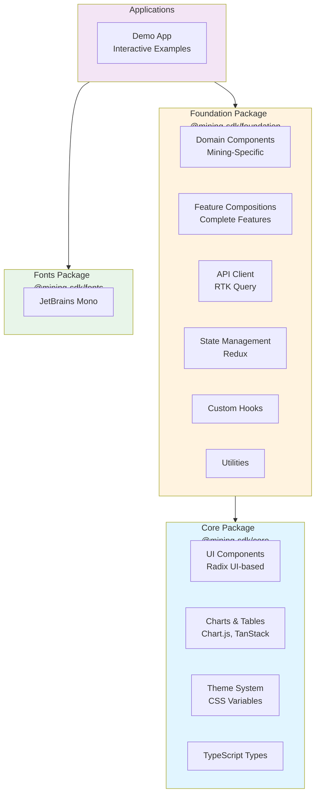

# Architecture

## Consolidated Two-Package Architecture

The Mining SDK uses a **simplified, consolidated architecture** with two main packages instead of many micro-packages:



**Key Design Decisions:**
- **Two-layer dependency**: Core → Foundation → Apps
- **Foundation exports TypeScript source** for fast dev iteration
- **Core exports built JavaScript** for stability and performance
- **Subpath exports** organize Foundation's internal structure

## Monorepo Structure

```
mining-sdk-ui-kit/
├── packages/
│   ├── core/                    # @mining-sdk/core
│   │   ├── src/
│   │   │   ├── components/      # Radix UI-based components
│   │   │   ├── types/           # TypeScript type definitions
│   │   │   ├── utils/           # Utility functions
│   │   │   ├── constants/       # Shared constants
│   │   │   ├── styles/          # SCSS source & mixins
│   │   │   └── theme/           # Theme system
│   │   └── dist/                # Built JS, types, and CSS
│   │
│   ├── foundation/              # @mining-sdk/foundation
│   │   ├── src/
│   │   │   ├── components/
│   │   │   │   ├── domain/      # Mining-specific components
│   │   │   │   └── feature/     # Complete feature compositions
│   │   │   ├── hooks/           # Custom React hooks
│   │   │   ├── api/             # API client (RTK Query)
│   │   │   ├── state/           # Redux state management
│   │   │   ├── utils/           # Utility functions
│   │   │   ├── types/           # Type definitions
│   │   │   ├── constants/       # Constants
│   │   │   └── test-utils/      # Testing utilities
│   │   └── dist/                # Built CSS only (TS source exported)
│   │
│   └── fonts/                   # @mining-sdk/fonts
│       └── dist/                # JetBrains Mono font files
│
├── apps/
│   ├── demo/                    # Interactive demo application
│   └── cli/                     # CLI tools (placeholder)
│
├── docs/                        # Documentation
└── scripts/                     # Build & utility scripts
```

## Package Dependencies

```mermaid
graph LR
    App[Your Application]
    Demo[@mining-sdk/demo]
    Foundation[@mining-sdk/foundation]
    Core[@mining-sdk/core]
    Fonts[@mining-sdk/fonts]

    App --> Foundation
    App --> Core
    App --> Fonts
    
    Demo --> Foundation
    Demo --> Core
    Demo --> Fonts
    
    Foundation --> Core

    style App fill:#4caf50
    style Demo fill:#2196f3
    style Foundation fill:#ff9800
    style Core fill:#9c27b0
    style Fonts fill:#8bc34a
```

**Simplified Dependencies:**
- Applications depend on `foundation`, `core`, and optionally `fonts`
- `foundation` depends on `core`
- `fonts` is independent
- No circular dependencies
- Clear, linear dependency chain

## Package Details

### `@mining-sdk/core`

**Purpose**: Core UI components, utilities, types, and theme system

**Export Strategy**: Built JavaScript (requires build step)

**Contents**:

- **Components**: Radix UI-based primitives (Button, Dialog, Accordion, etc.)
- **Charts**: Chart.js and Lightweight Charts integrations
- **Tables**: TanStack Table integration
- **Forms**: React Hook Form integration with Zod validation
- **Types**: TypeScript type definitions and interfaces
- **Utilities**: Pure utility functions (cn, formatters, validators)
- **Theme**: CSS variables and theme system
- **Styles**: SCSS source and compiled CSS

**Exports**:
```json
{
  ".": "./dist/index.js",
  "./styles.css": "./dist/styles.css",
  "./styles": "./src/styles/_mixins.scss"
}
```

**Usage**:

```typescript
import { Button, Dialog, DataTable, LineChart } from '@mining-sdk/core'
import '@mining-sdk/core/styles.css'
```

**Key Features**:

- Built on Radix UI primitives
- Chart.js & Lightweight Charts support
- TanStack Table for data grids
- Zero CSS-in-JS runtime
- Fully accessible (WCAG compliant)
- Class Variance Authority for variant styling

---

### `@mining-sdk/foundation`

**Purpose**: All-in-one foundation with domain components, features, state, API, hooks, and utilities

**Export Strategy**: TypeScript source (no build needed for workspace dependencies)

**Internal Structure**:

- `src/components/domain/` - Mining-specific components
- `src/components/feature/` - Complete feature compositions
- `src/hooks/` - Custom React hooks
- `src/api/` - API client using RTK Query
- `src/state/` - Redux Toolkit state management
- `src/utils/` - Utility functions
- `src/types/` - Type definitions
- `src/constants/` - Shared constants
- `src/test-utils/` - Testing utilities

**Exports**:
```json
{
  ".": "./src/index.ts",
  "./domain": "./src/components/domain/index.ts",
  "./feature": "./src/components/feature/index.ts",
  "./hooks": "./src/hooks/index.ts",
  "./api": "./src/api/index.ts",
  "./state": "./src/state/index.ts",
  "./test-utils": "./src/test-utils/index.ts",
  "./styles.css": "./dist/styles.css"
}
```

**Usage Examples**:

```typescript
// Domain components
import { MinerCard, PoolStats } from '@mining-sdk/foundation/domain'

// Feature compositions
import { Dashboard } from '@mining-sdk/foundation/feature'

// Custom hooks
import { useLocalStorage, useDebounce } from '@mining-sdk/foundation/hooks'

// API client
import { useGetMinersQuery } from '@mining-sdk/foundation/api'

// State management
import { store, useAppSelector } from '@mining-sdk/foundation/state'

// Testing utilities
import { render, mockMiner } from '@mining-sdk/foundation/test-utils'

// Styles
import '@mining-sdk/foundation/styles.css'
```

**Key Features**:

- Exports TypeScript source for fast development
- Organized via subpath exports
- Redux Toolkit for state management
- RTK Query for API integration
- Comprehensive testing utilities
- Domain-specific mining components

---

### `@mining-sdk/fonts`

**Purpose**: Font assets for the UI kit

**Contents**:

- JetBrains Mono font files
- Font face CSS definitions

**Usage**:

```typescript
import '@mining-sdk/fonts/jetbrains-mono.css'
```

**Note:** State management, hooks, API client, domain components, and feature modules are now consolidated within the `@mining-sdk/foundation` package. Access them via subpath exports:
  
- State: `@mining-sdk/foundation/state`
- Hooks: `@mining-sdk/foundation/hooks`
- API: `@mining-sdk/foundation/api`
- Domain: `@mining-sdk/foundation/domain`
- Features: `@mining-sdk/foundation/feature`

See the Foundation package documentation above for detailed usage examples.

---

## Technology Stack

### Core Framework

- **React** 19.0+ - UI framework
- **TypeScript** 5.8+ - Type safety (strict mode)
- **Vite** 6.3+ - Build tool

### Package Management

- **pnpm** 9+ - Fast, disk-efficient package manager
- **Turborepo** - Build orchestration with caching

### UI Components & Styling

- **shadcn/ui** - Copy-paste component collection (~46KB)
- **Radix UI** - Headless, accessible primitives (~30KB)
- **SASS/SCSS** - Styling (zero CSS-in-JS runtime)

### State Management

- **RTK Query** 2.2+ - Server state, data fetching, caching
- **Redux Toolkit** 2.2+ - UI state management
- **react-redux** 9.1+ - Redux bindings

### Forms & Validation

- **React Hook Form** 7.51+ - Form state management (5x faster than Formik)
- **Zod** 3.22+ - Schema validation (TypeScript-first)

### Data Visualization

- **Chart.js** 4.4+ - General charts
- **lightweight-charts** 4.1+ - Financial charts
- **react-chartjs-2** 5.2+ - React wrapper

### Utilities

- **date-fns** 3.6+ - Date manipulation
- **nanoid** 5.1+ - ID generation
- **p-queue** 8.0+ - Concurrency control
- **p-retry** 6.2+ - Retry logic
- **lodash-es** 4.17+ - Utility library

### Testing

- **Vitest** 3.0+ - Test runner
- **React Testing Library** 16.1+ - Component testing
- **@testing-library/user-event** 14.5+ - User interactions

### Build & Dev Tools

- **ESLint** 9.35+ - Linting (antfu config)
- **Husky** + **lint-staged** - Pre-commit hooks
- **Turborepo** - Monorepo build orchestration

### Monitoring

- **Sentry** 8.24+ - Error tracking

---

## Performance

### Bundle Size Targets

| Package                    | Target Size (gzipped) | Current Size |
| -------------------------- | --------------------- | ------------ |
| `@mining-sdk/core`         | < 200KB               | TBD          |
| `@mining-sdk/foundation`   | < 300KB               | TBD          |
| `@mining-sdk/fonts`        | < 30KB                | TBD          |

**Total**: < 530KB

**Note:** The consolidated architecture results in similar or better bundle sizes compared to the previous micro-package approach, with improved tree-shaking and fewer duplicate dependencies.

### Performance Metrics

- **Lighthouse Score**: > 90
- **Initial Load Time**: < 2s
- **Time to Interactive**: < 3s
- **Form Rendering**: < 10ms per keystroke (5x faster than Formik)

### Optimization Techniques

- **Tree-shaking**: All packages support tree-shaking
- **Code splitting**: Route-based and component-level
- **Lazy loading**: Heavy components loaded on-demand
- **CSS variables**: Zero CSS-in-JS runtime overhead
- **Intelligent caching**: RTK Query with 5-min retention
